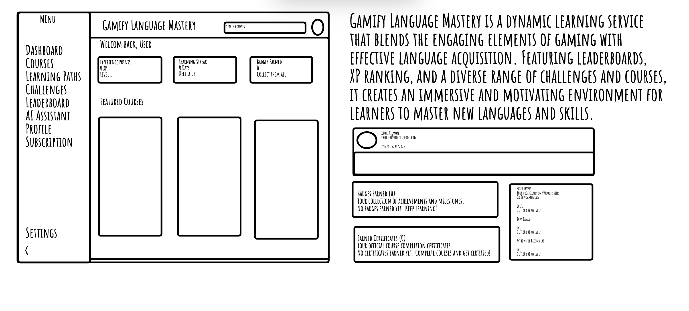

# ጌሚፋይ ላንጉዌጅ ማስተሪ (Gamify Language Mastery)

_በሌሎች ቋንቋዎችም ይህንን ያንብቡ፦:_
[_አማርኛ_](README.am-AM.md) [_English_](README.md)\

## የፕሮጀክቱ አጠቃላይ እይታ

ጌሚፋይ ላንጉዌጅ ማስተሪ የቋንቋን ትምህርት አስደሳች እና ውጤታማ ለማድረግ የተነደፈ መስተጋብራዊ የመማሪያ መድረክ ነው። በተለያዩ የፕሮግራም ቋንቋዎች ተጠቃሚዎች ክህሎታቸውን እንዲያሳድጉ ለማገዝ በጨዋታ መልክ የቀረቡ ስልቶችን እና በሰው ሰራሽ አስተውሎት (AI) የታገዘ ሲሆን ትምህርቶችን፣ ፈተናዎችን፣ የመማሪያ መንገዶችን እና ግላዊ ተልዕኮዎችን ያቀርባል።



ይህ ሰነድ የፕሮጀክቱን መዋቅር፣ አጠቃቀም እና ዋና ባህሪያትን ለመረዳት እና ለልማቱ አስተዋጽኦ ለማድረግ ይረዳዎታል።

## ዋና ባህሪያት

-   **የትምህርት መድረክ (Lesson Platform)፦** መስተጋብራዊ የትምህርት ገጽታ ያለው ሲሆን የትምህርት ሂደትን መከታተል ያስችላል።
-   **የኮርስ ዳሽቦርድ (Course Dashboard)፦** በጨዋታ መልክ የተዘጋጁ ክፍሎችን የትምህርት ሂደትን፣ ሞጁሎችን እና የተጠናቀቁ ደረጃዎችን አጠቃላይ ገጽታ ያሳያል።
-   **የተጠቃሚ መገለጫ (User Profile)፦** ባጆች (Badges)፣ የተጠናቀቁ ኮርሶችን እና ግላዊ ስታቲስቲክስን ለማየት የሚያስችል ገጽ።
-   **የጨዋታ አሰራር ዘዴ (Gamification System)፦** ትምህርቶችን እና ኮርሶችን በመጨረስ ነጥቦችን እና ባጆችን ማግኘት።
-   **በሰው ሰራሽ አስተውሎት የታገዘ ረዳት (AI-Powered Assistant)፦** የኮድ ምሳሌዎችን እና የስህተት ማብራሪያዎችን ለማግኘት የሚረዳ የ AI መሣሪያ።
-   **የጣቢያ አሰሳ (Site Navigation)፦** ተጠቃሚዎች ቁሳቁሶችን በፍጥነት እንዲያገኙ ለማስቻል የተወሰኑ ርዕሶችን መፈለግ።
-   **ተደራሽነት ቅንጅቶች (Accessibility Settings)፦** ለአካል ጉዳተኞች አጠቃላይ ተደራሽነት ቅንጅቶች።
-   **የደረጃ ሰንጠረዦች (Leaderboards)፦** በትምህርቶች ውስጥ የተማሪዎችን እድገት ማወዳደር።
-   **ዕለታዊ ተከታታይ ጉርሻዎች (Daily Streaks):** በተከታታይ ለሚማሩ ተጠቃሚዎች የሚሰጥ ዕለታዊ ጉርሻ።
-   **ፈተናዎች እና ተልዕኮዎች (Challenges and Quests)፦** ተጨማሪ ነጥቦችን እና ባጆችን ለማግኘት ፈተናዎችን መውሰድ እና ተልዕኮዎችን ማጠናቀቅ።
-   **የልምድ ነጥቦች (XP - Experience Points)፦** ትምህርቶችን፣ ፈተናዎችን ወይም ተልዕኮዎችን በማጠናቀቅ የሚገኙ።
-   **ደረጃቸውን የጠበቁ ባጆች (Graded Badges)፦** በአፈጻጸም ላይ ተመስርተው የነሐስ፣ የብር እና የወርቅ ባጆችን ማግኘት።
-   **የክህሎት ነጥቦች (Skill Points)፦** በክህሎት ደረጃ ላይ ተመስርተው የሚመደቡ (ለምሳሌ፣ "JavaScript Level 5")።
-   **የማጠናቀቂያ ባጆች (Completion Badges)፦** ኮርሶችን ወይም ሞጁሎችን ለማጠናቀቅ የሚሰጡ።
-   **የክህሎት ባጆች (Skill Badges)፦** የተወሰኑ ርዕሰ ጉዳዮችን በመቆጣጠር የሚገኙ (ለምሳሌ፣ "የፓይዘን (Python) ባለሙያ")።
-   **የተደበቁ ስኬቶች (Hidden Achievements)፦** ለተጨማሪ ተሳትፎ የሚሰጡ አስገራሚ ሽልማቶች (ለምሳሌ፣ ዘግይቶ ለማጥናት "Night Owl" የሚል ባጅ)።
-   **የእድገት አኒሜሽን (Progress Animations)፦** የኮርስ ማጠናቀቂያ መቶኛን ያሳያል።
-   **የመማሪያ መንገዶች (Learning Paths)፦** ሊከፈቱ የሚችሉ ደረጃዎችን ያካተተ የእይታ የመንገድ ካርታ።
-   **ተከታታይነት እና ዕለታዊ ግቦች (Streaks & Daily Goals)፦** በተከታታይ በመግባት የሚገኝ ጉርሻ (ለምሳሌ፣ "7-Day Streak Bonus")።
-   **ግላዊ ተልዕኮዎች (Personalized Missions)፦** AI መሣሪያ በተጠቃሚው ደካማ ጎኖች ላይ በመመስረት የሚያቀርባቸው ፈተናዎች።
-   **ሰርተፊኬቶች እና ጥቃቅን ማስረጃዎች (Certificates & Micro-Credentials)፦** በ LinkedIn ላይ መጋራት የሚቻል።
-   **የስኮላርሺፕ ነጥቦች (Scholarship Points)፦** ከፍተኛ ውጤት ላስመዘገቡ ተማሪዎች የሚሰጥ የክፍያ ቅናሽ።
-   **የሥራ/የልምምድ ሪፈራሎች (Job/Internship Referrals)፦** ከፍተኛ ደረጃ ላሉ ተማሪዎች የሚሰጥ ዕድል።
-   **ፈጣን ግብረመልስ (Instant Feedback)፦** ትክክለኛ መልሶችን በድምፅ እና በምስል ማጀብ።
-   **ፍንጮች እና ተጨማሪ ኃይሎች (Hints & Power-Ups)፦** አስቸጋሪ ጥያቄዎችን ለመመለስ የሚረዱ ውስን አጠቃቀም ያላቸው ነገሮች።
-   **የማካካሻ ፈተናዎች (Redemption Quizzes)፦** ከፊል ነጥብ ለማግኘት የወደቁትን ፈተናዎች በድጋሚ መውሰድ።

## የፕሮጀክት መዋቅር

ፕሮጀክቱ የሚከተሉትን ቁልፍ ማውጫዎች የያዘ የ Next.js መዋቅርን ይከተላል፡-

-   `docs/`: የፕሮጀክት ንድፍን ጨምሮ የሰነድ ፋይሎች።
-   `src/`: የመተግበሪያው የምንጭ ኮድ።
    -   `ai/`: AI-ነክ ሎጂክ እና ፍሰቶች።
        -   `dev.ts`: AI ፍሰቶችን እና ውቅሮችን ያስጀምራል።
        -   `flows/`: የተወሰኑ ባህሪያትን የያዙ AI ፍሰቶችን ይይዛል።
            -   `ai-powered-code-explanation.ts`: የኮድ ቁርጥራጮችን ለማብራራት ፍሰት።
            -   `suggest-personalized-challenges.ts`: በተጠቃሚው ደካማ ጎኖች ላይ በመመስረት ግላዊ ፈተናዎችን ለመጠቆም ፍሰት።
        -   `genkit.ts`: የ Genkit AI ማዋቀር እና ውቅር።
    -   `app/`: Next.js የመተግበሪያ ራውተር ማውጫ።
        -   `(app)/`: የመተግበሪያ መንገዶች።
            -   `ai-assistant/`: ከ AI ረዳት ጋር የተያያዙ ገጾች።
                -   `page.tsx`: የ AI ረዳት ገጽ, የኮድ ማብራሪያ እና ግላዊ ተልዕኮዎችን ያዋህዳል።
            -   `challenges/`: ከፈተናዎች እና ተልዕኮዎች ጋር የተያያዙ ገጾች።
                -   `page.tsx`: የተለያዩ አይነት ፈተናዎችን የሚያሳይ የፈተናዎች ገጽ።
            -   `courses/`: ከኮርሶች ጋር የተያያዙ ገጾች።
                -   `[courseId]/`: ለእያንዳንዱ የኮርስ ገጾች ተለዋዋጭ መንገድ።
                    -   `certificate/`: ከኮርስ ሰርተፊኬቶች ጋር የተያያዙ ገጾች።
                        -   `page.tsx`: የሰርተፍኬት ማሳያ ገጽ።
                    -   `lessons/`: ከኮርስ ትምህርቶች ጋር የተያያዙ ገጾች።
                        -   `[lessonId]/`: ለእያንዳንዱ የትምህርት ገጾች ተለዋዋጭ መንገድ።
                            -   `page.tsx`: የትምህርት ይዘትን እና ሂደትን የሚያሳይ የትምህርት ገጽ።
                    -   `page.tsx`: የኮርስ ዝርዝሮችን እና ሞጁሎችን የሚያሳይ የኮርስ ገጽ።
            -   `dashboard/`: ዳሽቦርድ ገጽ።
                -   `page.tsx`: የተጠቃሚ ዳሽቦርድ, ዋና ኮርሶችን, ግላዊ ተልዕኮዎችን እና የእንቅስቃሴ ማጠቃለያዎችን ያካትታል.
            -   `leaderboard/`: የደረጃ ሰንጠረዥ ገጽ።
                -   `page.tsx`: የተጠቃሚ ደረጃዎችን የሚያሳይ የደረጃ ሰንጠረዥ ገጽ።
            -   `learning-paths/`: የመማሪያ መንገዶች ገጽ።
                -   `page.tsx`: የሚገኙ የመማሪያ መንገዶችን የሚያሳይ ገጽ።
            -   `profile/`: የመገለጫ ገጽ።
                -   `page.tsx`: የተጠቃሚ መረጃን እና ሂደትን የሚያሳይ የተጠቃሚ መገለጫ ገጽ።
            -   `settings/`: የቅንጅቶች ገጾች።
                -   `accessibility/`: ተደራሽነት ቅንጅቶች ገጽ።
                    -   `page.tsx`: የማበጀት አማራጮች ያሉት የተደራሽነት ቅንጅቶች ገጽ።
            -   `subscription/`: የደንበኝነት ምዝገባ አስተዳደር ገጽ።
                -   `page.tsx`: ተጠቃሚዎች የደንበኝነት ምዝገባቸውን ሁኔታ እንዲያስተዳድሩ የሚያስችል የደንበኝነት ምዝገባ አስተዳደር ገጽ።
            -   `layout.tsx`: ዋናው የመተግበሪያ አቀማመጥ።
            -   `page.tsx`: መነሻ ገጽ።
        -   `auth/`: የማረጋገጫ ገጾች።
            -   `page.tsx`: ለመግባት እና ለመመዝገብ የማረጋገጫ ገጽ።
        -   `globals.css`: ዓለም አቀፍ የ CSS ስታይል ሉህ።
        -   `layout.tsx`: የመተግበሪያው ሥር አቀማመጥ።
        -   `page.tsx`: ለመተግበሪያው ማረፊያ ገጽ።
    -   `components/`: እንደገና ጥቅም ላይ የሚውሉ ክፍሎች።
        -   `accessibility/`: ከተደራሽነት ጋር የተያያዙ ክፍሎች።
            -   `accessibility-settings-form.tsx`: የተደራሽነት ቅንጅቶች ቅጽ።
        -   `ai/`: ከ AI ጋር የተያያዙ ክፍሎች።
            -   `ai-code-explainer.tsx`: ኮድን በ AI በመጠቀም ለማብራራት የሚያስችል ክፍል።
            -   `personalized-challenges-display.tsx`: በ AI የተጠቆሙ ግላዊ ፈተናዎችን ለማሳየት የሚያስችል ክፍል።
        -   `layout/`: ከአቀማመጥ ጋር የተያያዙ ክፍሎች።
            -   `header.tsx`: የመተግበሪያው ርዕስ ክፍል።
            -   `main-nav.tsx`: ዋና የአሰሳ ክፍል።
            -   `user-nav.tsx`: የተጠቃሚ አሰሳ ክፍል።
        -   `payment/`: ከክፍያ ጋር የተያያዙ ክፍሎች።
            -   `payment-modal.tsx`: የክፍያ ሞዳል ክፍል።
        -   `shared/`: በመተግበሪያው ውስጥ ጥቅም ላይ የሚውሉ የተጋሩ ክፍሎች።
            -   `logo.tsx`: የሎጎ ክፍል።
            -   `search-bar.tsx`: የፍለጋ አሞሌ ክፍል።
        -   `ui/`: በ Radix UI እና Tailwind CSS የተገነቡ የ UI ክፍሎች።
            -   `*`: እንደ አዝራሮች፣ ካርዶች፣ ትሮች፣ ወዘተ ያሉ የተለያዩ የ UI ክፍሎች።
        -   `accessibility-settings-form.tsx`: ለተደራሽነት ቅንጅቶች ቅጽ አካል።
        -   `ai-code-explainer.tsx`: ለ AI-powered ኮድ ገላጭ ክፍል።
        -   `personalized-challenges-display.tsx`: ግላዊ ፈተናዎችን ለማሳየት ክፍል።
    -   `hooks/`: ብጁ React Hooks።
        -   `use-mobile.tsx`: ተንቀሳቃሽ መሣሪያዎችን ለመለየት Hook።
        -   `use-toast.ts`: የ Toast ማሳወቂያዎችን ለማስተዳደር Hook።
    -   `lib/`: የመገልገያ እና ረዳት ተግባራት።
        -   `mock-data.ts`: ለልማት እና ለሙከራ የሚሆን የሞክ (Mock) መረጃ።
        -   `utils.ts`: የመገልገያ ተግባራት።
    -   `services/`: የውጭ አገልግሎቶች ውህደት።
        -   `paymentService.ts`: የሞክ ክፍያ አገልግሎት።
    -   `types/`: TypeScript ዓይነት ትርጓሜዎች።
        -   `index.ts`: በመተግበሪያው ውስጥ ጥቅም ላይ ለሚውሉ የተለያዩ የመረጃ አወቃቀሮች የዓይነት ትርጓሜዎች።

## ፕሮጀክቱን ማዋቀር

1.  **ማጠራቀሚያውን (Repository) ክሎን ያድርጉ (Clone):**

    ```bash
    git clone <የማጠራቀሚያው_ዩአርኤል>
    cd Gamify-Language-Mastery
    ```

2.  **ጥገኛዎችን ይጫኑ (Install dependencies):**

    ```bash
    npm install
    ```

3.  **የአካባቢ ተለዋዋጮችን (Environment Variables) ያዘጋጁ:**

    በዋናው ማውጫ ውስጥ `.env` ፋይል ይፍጠሩ እና እንደ የኤፒአይ ቁልፎች ለመተግበሪያው የሚያስፈልጉትን የአካባቢ ተለዋዋጮች ያክሉ። የሚገኝ ከሆነ `.env.example` ይመልከቱ።

4.  **የልማት አገልጋዩን (Development Server) ያስጀምሩ:**

    ```bash
    npm run dev
    ```

    ይህ ትዕዛዝ የ Next.js የልማት አገልጋይን ያስጀምራል፣ በአብዛኛው በፖርት 3000 ላይ።

5.  **Genkit AI አገልጋይን ያስጀምሩ (አማራጭ):**

    በ AI የሚደገፉ ባህሪያት እንዲሰሩ፣ የ Genkit አገልጋይን ያስጀምሩ፡

    ```bash
    npm run genkit:dev
    ```

    ወይም፣ ለውጦችን ለመከታተል እና በራስ-ሰር እንደገና ለማስጀመር፡-

    ```bash
    npm run genkit:watch
    ```

## Lighthouse ኦዲትን ማስኬድ

   ```bash
    npx -y lighthouse "http://0.0.0.0:9000/"     --output-path /tmp/lighthouse-1748639769199.html     --only-categories=performance,accessibility,best-practices,seo,pwa     --no-enable-error-reporting     --ignore-status-code     --chrome-flags="--headless=new --disable-dev-shm-usage" 

   ```

## ቁልፍ ቴክኖሎጂዎች

-   **Next.js:** የድር መተግበሪያዎችን ለመገንባት የ React ማዕቀፍ።
-   **TypeScript:** JavaScriptን የሚጨምር እና የማይንቀሳቀስ ትየባን (Static Typing) የሚጨምር ቋንቋ።
-   **Tailwind CSS:** ለቅጥ አሰራር የመገልገያ-መጀመሪያ የ CSS ማዕቀፍ።
-   **Radix UI:** ዩአይዎችን ለመገንባት ያልተሰየሙ፣ ተደራሽ የሆኑ ክፍሎች።
-   **Genkit AI:** አወቃያዊ AI መተግበሪያዎችን ለመገንባት ማዕቀፍ።
-   **Firebase:** ለማረጋገጫ፣ ለመረጃ ማከማቻ እና ለተጨማሪ አገልግሎቶች የሚውል የጀርባ አገልግሎት።

## መዋጮ ማድረግ

መዋጮዎች በደስታ ይቀበላሉ! አስተዋፅኦ ለማድረግ እነዚህን ደረጃዎች ይከተሉ፡

1.  ማጠራቀሚያውን ፎርክ ያድርጉ (Fork the repository)።
2.  ለባህሪዎ ወይም ለሳንካ ጥገናዎ አዲስ ቅርንጫፍ ይፍጠሩ።
3.  ለውጦችዎን ያድርጉ እና ግልጽ በሆኑ አጫጭር መልእክቶች ያስቀምጡ።
4.  ለውጦችዎን በደንብ ይሞክሩ።
5.  የመጎተት ጥያቄ (Pull Request) ያስገቡ።

## ፈቃድ (License)

ይህ ፕሮጀክት በ [የፍቃድ ስም (License Name)] ፈቃድ ስር ዋስትና ተሰጥቶታል - ለዝርዝሮች [LICENSE.md](LICENSE.md) ፋይሉን ይመልከቱ።

